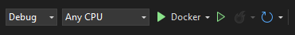
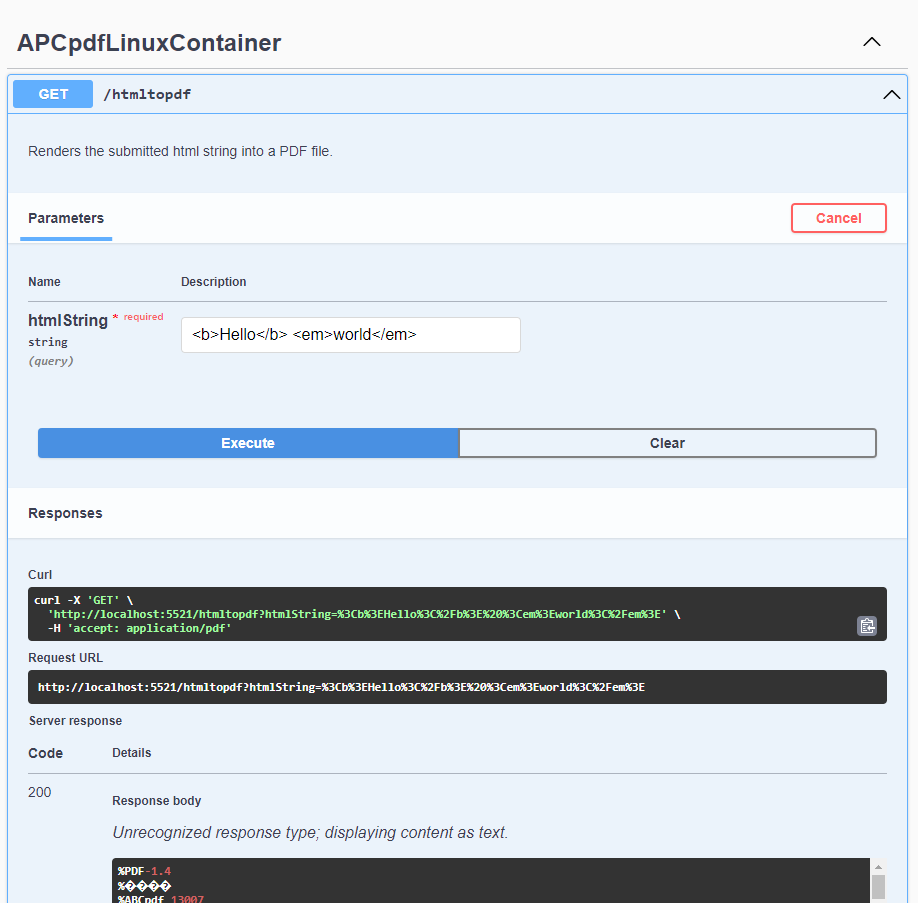
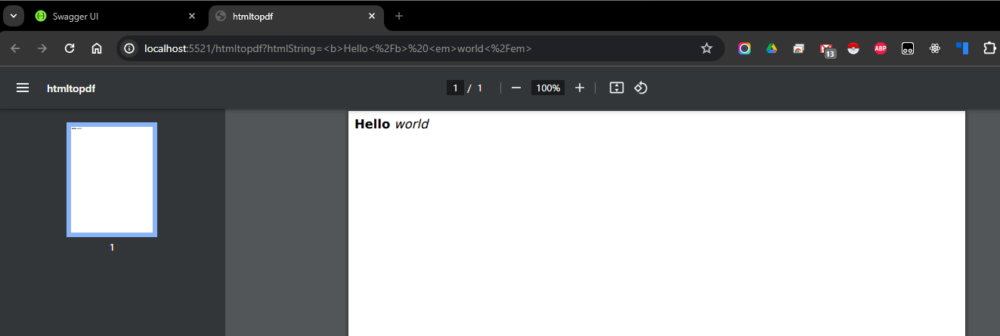

# ABCpdf in a Linux Container

Linux has been supported since version 13 of ABCpdf. Here is an example project to show how to run ABCpdf as a containerized microservice using a Docker image based on Ubuntu 22.04 LTS. This allows in-container debugging in Visual Studio 2022 and later. You may use this as a template for your own ABCpdf-powered microservice.

This project was initially generated using the ASP.NET Core Web API template using Visual Studio 2022 with the default options of Docker and OpenAPI support enabled. It uses the minimal API model to expose a test endpoint.

## Building and Running the Application

### Pre-requisites

* Visual Studio 2022 or Later
* [Docker Desktop](https://www.docker.com/) or [Docker Community Edition](https://docs.docker.com/engine/install/)

### Running the Application

Clone the APCpdfLinuxContainer repository and open the solution in Visual Studio 2022.

Select Docker from the Debugging toolbar dropdown if it isn't already selected. You may be prompted to start Docker Desktop which you should do - it has to be running to run the project in a container.



The first time the solution is opened and Docker debugging is selected you will have to wait some time while Visual Studio performs the background task of "Warming up Docker debugging". This is performing a preliminary build of the Dockerfile including pulling the required images from Docker Hub. To see what it is doing and when it has finished check the "Output" tab and "Container Tools" from the dropdown.

**Be prepared for this to take 5 or more minutes the first time.** This is the only time you have to wait this long as the build is cached making the subsequent development workflow very fast.

While you wait you should find your ABCpdf license key and paste it into the Program.cs file where indicated near the top of the file.

```C#
if(!XSettings.InstallLicense("[-- PASTE YOUR LICENSE CODE HERE --]")) {
    throw new Exception("License failed installation.");
}
```

Once the Dockerfile has been built as indicated in the Container Tools Output window you can run the application from the debug toolbar as Docker:

This will spin up a container to run the application launch your default browser to the OpenAPI swagger page.

### Trying It Out

The Swagger UI will show one GET endpoint of `/htmltopdf/` which simply implements [AddImageHtml()](https://www.websupergoo.com/helppdfnet/default.htm?page=source%2f5-abcpdf%2fdoc%2f1-methods%2faddimagehtml.htm) on the text.

Expand the section for this endpoint and click the "Try it out" button and enter some HTML like the following.

```html
<p><strong>Hello</strong> <em>world</em> &#128578;
```



Now you should see the byte array contents of a PDF document displayed as text in the "Response Body" text area which is not very useful!

To actually view the generated PDF copy the link in the "Request URL" and paste it into the address bar of your browser. It will be something like the following but with a randomly generated port:

```bash
http://localhost:5521/htmltopdf?htmlString=%3Cb%3EHello%3C%2Fb%3E%20%3Cem%3Eworld%3C%2Fem%3E
```
This should load up a PDF in the browser as follows:


### Language Support

The abcpdf Docker image used have support for a number of language character sets. You may test this with the application using the following Ukrainian, Arabic and Hebrew language examples:

```html
Here are some examples you could use to highlight the use of different languages and even emojis using the default abcpdf repository image:
<p><strong>Привіт</strong> <em>Світ</em></p>
<p><strong>مرحبا</strong> <em>بالعالم</em></p>
<p><strong>שלום</strong> <em>עולם</em></p>
```

## Installing Additional Languages

### Noto Fonts

For other languages you will need to install additional fonts and/or language pack resources in the Dockerfile.

A good balance for CJK languages is to simply add the installation of the [Google's Noto fonts](https://fonts.google.com/noto) CJK package to the Dockerfile:

```Dockerfile
FROM abcpdf/ubuntu-22.04-aspnet:8.0 AS base
WORKDIR /app
EXPOSE 8080
EXPOSE 8081
RUN apt-get update && apt-get install -y fonts-noto-cjk
RUN fc-cache -f -v
```

There are [additional Noto languages packages here](https://packages.debian.org/sid/fonts-noto).

### Language Pack Installation

Alternatively you may install the relevant language packs using following commands to the runtime Dockerfile:

```Dockerfile
FROM abcpdf/ubuntu-22.04-aspnet:8.0 AS base
WORKDIR /app
EXPOSE 8080
EXPOSE 8081
RUN apt-get update
# Japanese
RUN apt-get install -y language-pack-ja install japan*
# Chinese
RUN apt-get install -y language-pack-zh* chinese*
# Korean
RUN apt-get install -y language-pack-ko install korean*
```

Other languages may be similarly installed. See [the Ubuntu packages site](https://packages.ubuntu.com/search?keywords=language-pack) to find your desired language pack.

## ABCpdf Runtime Docker Images

The .NET 8.0 runtime image used in this project is [abcpdf/ubuntu-22.04-aspnet:8.0](https://hub.docker.com/repository/docker/abcpdf/ubuntu-22.04-aspnet/general) which is based on Ubuntu 22.04 LTS. This image includes the requisite libraries required by the linux-native components of ABCpdf as well as a basic set of fonts.

The Dockerfiles used to create the Docker Hub Docker images are [available here](https://github.com/ABCpdf-Team/ABCpdf-Dockerfiles/tree/main/Runtimes/Ubuntu/22.04). You may use these to roll-your-own image.

### Further Reading

Please refer to [the latest ABCpdf linux documentation](https://www.websupergoo.com/helppdfnet/default.htm?page=source%2f2-getting_started%2f6-platforms.htm) for further information.