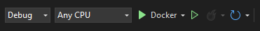
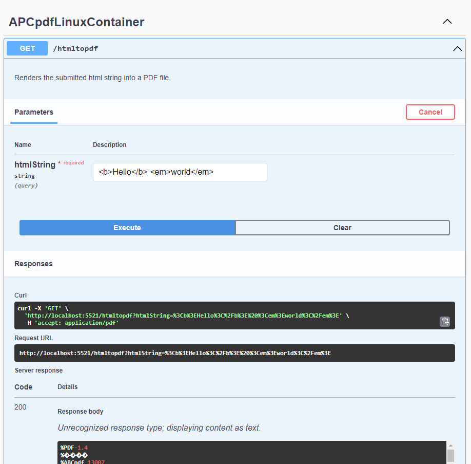
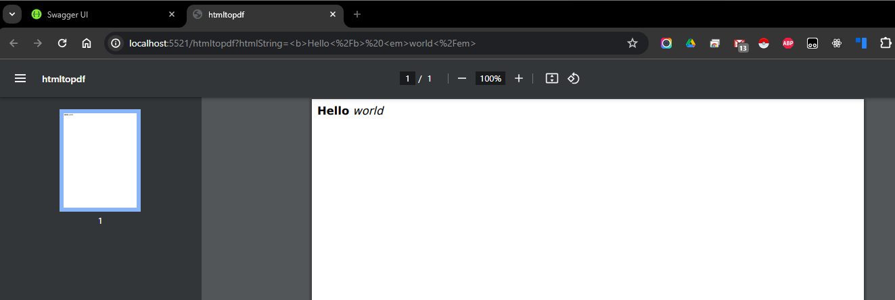

# ABCpdf in a Linux Container

Here is an example project to show how to use the [ABCpdf docker hub images](https://hub.docker.com/r/abcpdf/abcpdf) to build, debug and deploy an ABCpdf .NET powered containerized microservice.

This project was initially generated using the ASP.NET Core Web API template using Visual Studio 2026 with the default options of Docker and OpenAPI support enabled. It uses the minimal API model to expose a test endpoint.

## Building and Running the Application

### Pre-requisites

* Visual Studio 2026 or Later (it may also work in earlier versions)
* [Docker Desktop](https://www.docker.com/) or [Docker Community Edition](https://docs.docker.com/engine/install/)

### Running the Application

Clone the ABCpdfLinuxContainer repository and open the solution in Visual Studio 2026.

#### Set Your ABCpdf License Key

The application reads its license key from the `ABCPDF_LICENSE_KEY` environment variable.

```ps
$env:ABCPDF_LICENSE_KEY = "[-- PASTE YOUR LICENSE CODE HERE --]"
```

For local development you can instead copy [`.secrets.example`](.secrets.example) at the repo root to `.secrets` and paste your key in there - it's git-ignored, and only ever consulted in Debug builds when the environment variable isn't set.

**NB: You are responsible for keeping your ABCpdf license key secure. You should never persist your license key in a code repository.**

#### Build the Solution using the Docker Profile

Select Docker from the Debugging toolbar dropdown if it is not already selected. You may be prompted to start Docker Desktop which you should do - it has to be running to run the project in a container.



The first time the solution is opened and Docker debugging is selected you will have to wait some time while Visual Studio performs the background task of "Warming up Docker debugging". This is performing a preliminary build of the Dockerfile including pulling the required images from Docker Hub. To see what it is doing and when it has finished check the "Output" tab and "Container Tools" from the dropdown.

**Be prepared for this to take 5 or more minutes the first time.** This is the only time you have to wait this long as the build is cached making the subsequent development workflow very fast.

Once the Dockerfile has been built as indicated in the Container Tools Output window you can run the application from the debug toolbar as Docker:

This will spin up a container to run the application launch your default browser to the OpenAPI swagger page.

### Trying It Out

The Swagger UI will show one GET endpoint of `/htmltopdf` which takes a single `htmlOrUrl` parameter. If the value starts with `http` it's rendered via `AddImageUrl()`; otherwise it's treated as raw HTML and rendered via [AddImageHtml()](https://www.websupergoo.com/helppdfnet/default.htm?page=source%2f5-abcpdf%2fdoc%2f1-methods%2faddimagehtml.htm).

The application also exposes a `/health` endpoint (backed by ASP.NET Core health checks), which the container image's own Docker `HEALTHCHECK` polls to report its readiness.

Expand the section for this endpoint and click the "Try it out" button and enter some HTML like the following.

```html
<p><strong>Hello</strong> <em>world</em> &#128578;
```



Now you should see the byte array contents of a PDF document displayed as text in the "Response Body" text area which is not very useful!

To actually view the generated PDF copy the link in the "Request URL" and paste it into the address bar of your browser. It will be something like the following but with a randomly generated port:

```bash
http://localhost:5521/htmltopdf?htmlOrUrl=%3Cb%3EHello%3C%2Fb%3E%20%3Cem%3Eworld%3C%2Fem%3E
```
This should load up a PDF in the browser as follows:


### Language Support

The abcpdf Docker image used have support for a number of language character sets. You may test this with the application using the following Ukrainian, Arabic and Hebrew language examples:

```html
<p><strong>Привіт</strong> <em>Світ</em></p>
<p><strong>مرحبا</strong> <em>بالعالم</em></p>
<p><strong>שלום</strong> <em>עולם</em></p>
```

## Installing Additional Languages

### Noto Fonts

For other languages you will need to install additional fonts and/or language pack resources in the Dockerfile.

A good balance for CJK languages is to simply add the installation of the [Google's Noto fonts](https://fonts.google.com/noto) CJK package to the Dockerfile:

```Dockerfile
FROM abcpdf/abcpdf:14 AS base
RUN apt-get update && apt-get install -y fonts-noto-cjk && fc-cache -f -v
USER app
WORKDIR /app
EXPOSE 8080
```

Install packages before the `USER app` line - the container runs as that non-root user from there on, and `apt-get` needs root.

There are [additional Noto languages packages here](https://packages.debian.org/sid/fonts-noto).

### Language Pack Installation

Alternatively you may install the relevant language packs using following commands to the runtime Dockerfile:

```Dockerfile
FROM abcpdf/abcpdf:14 AS base
RUN apt-get update
# Japanese
RUN apt-get install -y language-pack-ja install japan*
# Chinese
RUN apt-get install -y language-pack-zh* chinese*
# Korean
RUN apt-get install -y language-pack-ko install korean*
USER app
WORKDIR /app
EXPOSE 8080
```

Other languages may be installed in a similar fashion. See [the Ubuntu language pack pages](https://packages.ubuntu.com/search?keywords=language-pack) to find your desired language pack.

The Dockerfiles used to create the Docker Hub Docker images are [available here](https://github.com/ABCpdf-Team/ABCpdf-Dockerfiles/tree/main/dockerfiles). You may use these to roll-your-own image.

## Security Considerations

### Our Update Cycle

All of our images are rebuilt with the latest OS security and package updates and pushed to the Docker Hub every Tuesday at 3am UTC.

### ABCpdf Chiseled Ubuntu Images

We now offer [chiseled Ubuntu images](https://hub.docker.com/r/abcpdf/abcpdf/tags) to maximise your application's attack surface. These images contain no shell and virtually no commands. These are strongly recommended for production environments. See the [chiseled image customisation guide](https://github.com/ABCpdf-Team/ABCpdf-Dockerfiles/blob/main/Chisel-customisation.md) for how to customise a chiseled base image.

### Non-root user

The Dockerfile we use in this project makes use of the 'app' USER as specified in the [ASP.NET Core Runtime images](https://hub.docker.com/_/microsoft-dotnet-aspnet/). This ensures that root access is unavailable in the deployed container in production if you are unable to use chiseled images (see above).

## Further Reading

You should refer to [ABCpdf Dockerfile GitHub repoistory](https://github.com/ABCpdf-Team/ABCpdf-Dockerfiles/) for the latest docker-specific information.
